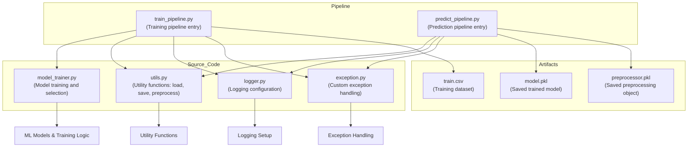

# 🎯 Student Performance Prediction Pipeline

This project is a complete **Machine Learning pipeline** for predicting student performance based on various demographic and academic features.  
It includes data preprocessing, model training, and prediction functionality.

---

## 📂 Project Structure

```plaintext
project/
│
├── artifacts/ # Stores training data, model, preprocessor, and saved models
│ ├── train.csv
│ ├── test.csv
│ ├── model.pkl
│ ├── preprocessor.pkl
│ └── data.csv
│
├── notebook/ # Jupyter notebooks for EDA and modeling
│ ├── 1 . EDA STUDENT PERFORMANCE .ipynb
│ ├── 2. MODEL TRAINING.ipynb
│ └── data/
│ └── stud.csv
│
├── src/ # Source code
│ ├── components/ # Core components like data ingestion, transformation, training
│ │ ├── init.py
│ │ ├── data_ingestion.py
│ │ ├── data_transformation.py
│ │ └── model_trainer.py
│ ├── exception.py # Custom exceptions
│ ├── logger.py # Logging setup
│ ├── pipeline/ # Pipeline orchestration scripts
│ │ ├── init.py
│ │ ├── predict_pipeline.py
│ │ └── train_pipeline.py
│ └── utils.py # Utility functions
│
├── templates/ # HTML templates for Flask app (if any)
│ ├── home.html
│ └── index.html
│
├── app.py # Flask app for local development/testing
├── application.py # WSGI application entry for AWS Elastic Beanstalk
├── print_project_tree.py # Utility to print project structure
├── requirements.txt # Python dependencies
├── setup.py # Package setup (optional)
└── README.md # This documentation
```

## 📊 Dataset

Sample dataset (`train.csv`) used in `artifacts/`:

gender,race_ethnicity,parental_level_of_education,lunch,test_preparation_course,math_score,reading_score,writing_score

female,group B,bachelor's degree,standard,none,72,72,74

female,group C,some college,standard,completed,69,90,88

female,group B,master's degree,standard,none,90,95,93


# 📂 Project Structure Overview



# ⚙️ Installation

Clone the repository

    git clone https://github.com/yourusername/student-performance-pipeline.git

    cd student-performance-pipeline


Create a virtual environment

    python -m venv venv
    
    source venv/bin/activate  # On Mac/Linux
    
    venv\Scripts\activate     # On Windows

Install dependencies

    pip install -r requirements.txt

## 🚀 Running the Flask Application

1. **Start the server**

```bash
    python app.py
```

2. **Open your browser and visit**
```bash
    Home / Index page: http://127.0.0.1:5000

    Prediction endpoint: http://127.0.0.1:5000/predictdata
```

# 🚀 Running the Training Pipeline

To train the model with the dataset in artifacts/train.csv:

python src/pipeline/train_pipeline.py

This will:

    Load and preprocess the training data

    Train the model

    Save the trained model (model.pkl) and preprocessor (preprocessor.pkl) in artifacts/

# 🔮 Making Predictions

Example usage:

from src.pipeline.predict_pipeline import CustomData, PredictPipeline

# Prepare custom input data

    data = CustomData(
    
        gender="female",
        
        race_ethnicity="group B",
        
        parental_level_of_education="bachelor's degree",
        
        lunch="standard",
        
        test_preparation_course="none",
        
        reading_score=72,
        
        writing_score=74
        
    )

# Convert to DataFrame
    df = data.get_data_as_data_frame()

# Load model and make prediction

    predict_pipeline = PredictPipeline()
    
    result = predict_pipeline.predict(df)
    
    print(f"Predicted Math Score: {result}")

# 📜 Logging

Logging is enabled in the train_pipeline and other scripts using:

    from src.logger import logging

Logs provide step-by-step execution tracking for easier debugging.


    Ensure your CSV file matches the column structure expected by the preprocessing function.

    The CustomData class must match your dataset’s feature names exactly.

    artifacts/ will be automatically updated when retraining.

