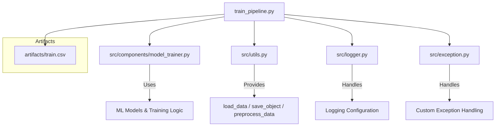

# 🎯 Student Performance Prediction Pipeline

This project is a complete **Machine Learning pipeline** for predicting student performance based on various demographic and academic features.  
It includes data preprocessing, model training, and prediction functionality.

---

## 📂 Project Structure

```plaintext
project/
│
├── artifacts/                     # Stores training data, model, preprocessor
│   ├── train.csv
│   ├── model.pkl
│   ├── preprocessor.pkl
│
├── src/                            # Source code
│   ├── components/
│   │   ├── model_trainer.py
│   ├── utils.py
│   ├── exception.py
│   ├── logger.py
│   ├── pipeline/
│       ├── predict_pipeline.py
│       ├── train_pipeline.py
│
├── README.md                       # Project documentation
├── requirements.txt                # Python dependencies
```

## 📊 Dataset

Sample dataset (`train.csv`) used in `artifacts/`:

gender,race_ethnicity,parental_level_of_education,lunch,test_preparation_course,math_score,reading_score,writing_score

female,group B,bachelor's degree,standard,none,72,72,74

female,group C,some college,standard,completed,69,90,88

female,group B,master's degree,standard,none,90,95,93


# 📂 Project Structure Overview



# ⚙️ Installation

    Clone the repository

git clone https://github.com/yourusername/student-performance-pipeline.git

cd student-performance-pipeline

    Create a virtual environment

python -m venv venv

source venv/bin/activate  # On Mac/Linux

venv\Scripts\activate     # On Windows

    Install dependencies

pip install -r requirements.txt

##🚀 Running the Training Pipeline

To train the model with the dataset in artifacts/train.csv:

python src/pipeline/train_pipeline.py

This will:

    Load and preprocess the training data

    Train the model

    Save the trained model (model.pkl) and preprocessor (preprocessor.pkl) in artifacts/

# 🔮 Making Predictions

Example usage:

from src.pipeline.predict_pipeline import CustomData, PredictPipeline

# Prepare custom input data

data = CustomData(
    gender="female",
    
    race_ethnicity="group B",
    
    parental_level_of_education="bachelor's degree",
    
    lunch="standard",
    
    test_preparation_course="none",
    
    reading_score=72,
    
    writing_score=74
    
)

# Convert to DataFrame
df = data.get_data_as_data_frame()

# Load model and make prediction

predict_pipeline = PredictPipeline()

result = predict_pipeline.predict(df)

print(f"Predicted Math Score: {result}")

# 📜 Logging

Logging is enabled in the train_pipeline and other scripts using:

from src.logger import logging

Logs provide step-by-step execution tracking for easier debugging.
# 📌 Notes

    Ensure your CSV file matches the column structure expected by the preprocessing function.

    The CustomData class must match your dataset’s feature names exactly.

    artifacts/ will be automatically updated when retraining.

